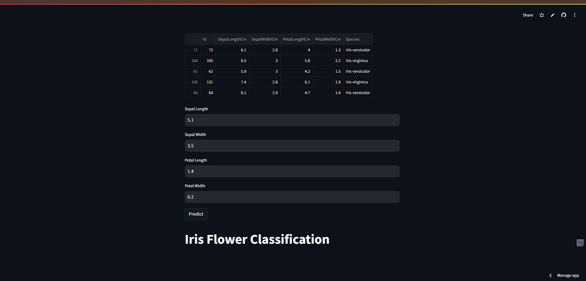
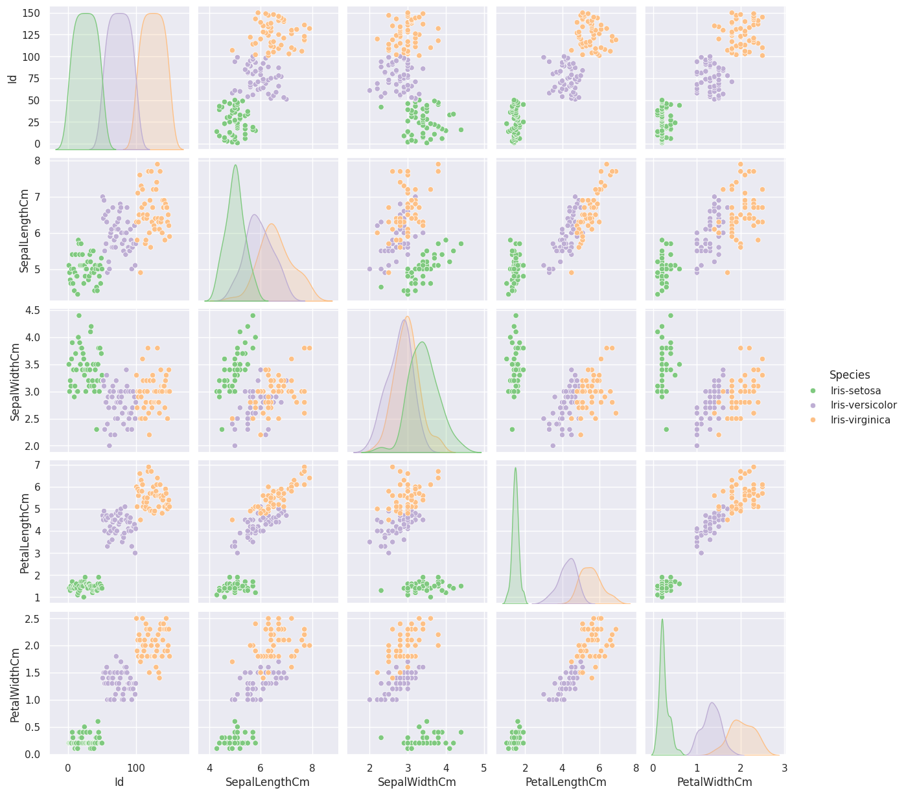

# IRIS FLOWER PREDICTION 


## Project Overview

This repository contains a machine learning project developed using Python, focusing on predictive modeling with Logistic Regression. The project achieved 100% accuracy, demonstrating the effectiveness of the implemented approach.

## Tech Stack
- **Programming Language:** Python
- **Data Manipulation:** 
  - NumPy
  - Pandas
- **Machine Learning:** 
  - Scikit-learn (sklearn)
  - Logistic Regression
- **Data Visualization:** 
  - Matplotlib
  - Seaborn
- **Model Persistence:** Pickle (pkl)
- **Web Application:** Streamlit

## Project Structure
```
irisapp
|iris.csv                                                 # Datasets
|app.py                                                   # Actual Application Model
│iris.jpg                                                 #Iris image
│iris_logistic_regression_model (2).pkl                   #Predictive model .pkl file
│logistic_regression (1).ipynb                            #jupyter notebook  
```

## Installation

### Prerequisites
- Python 3.8+
- pip

### Setup
1. Clone the repository
```bash
git clone https://github.com/sahkanu34/irisapp.git
cd your-repo-name
```

2. Create a virtual environment
```bash
python -m venv venv
source venv/bin/activate  # On Windows, use `venv\Scripts\activate`
```

3. Install dependencies
```bash
pip install -r requirements.txt
```

## Model Performance



- **Algorithm:** Logistic Regression
- **Accuracy:** 100%
- **Key Metrics:** Precision, Recall, F1-Score (details in notebooks)

## Running the Project

### Jupyter Notebook Analysis
Open the Jupyter Notebooks to explore data analysis and model development:
```bash
  use .ipynb notebook
```

### Streamlit Web Application
Launch the interactive web app:
```bash
streamlit run streamlit_ap.py
```

## Future Improvements
- Expand feature engineering
- Experiment with other machine learning algorithms
- Enhance model interpretability

## Contributing
1. Fork the repository
2. Create your feature branch (`git checkout -b feature/AmazingFeature`)
3. Commit your changes (`git commit -m 'Add some AmazingFeature'`)
4. Push to the branch (`git push origin feature/AmazingFeature`)
5. Open a Pull Request

## License
Specify your license here (e.g., MIT License)

## Contact
Suraj Sah Kanu - surajsah132@gmail.com
Project Link: [https://irisapp-8rysylun8wgisfsk7ksxgs.streamlit.app/]
